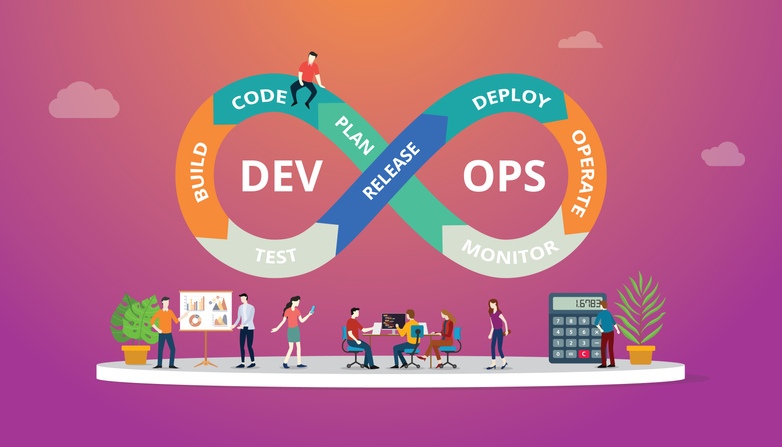

# DevOps

## ¿Por qué apostar por esta filosofía?.

DevOps es una metodología que busca romper las barreras entre los equipos de desarrollo de software y las operaciones de tecnología. La idea principal es que ambos trabajen juntos de forma más coordinada y automatizada para crear y entregar software de mejor calidad y con mayor rapidez.

## ¿En qué consiste DevOps?.

DevOps es un marco de trabajo, pero más que eso una filosofía en constante evolución que busca optimizar la producción. Para ello promueve la comunicación, integración, visibilidad y colaboración entre todos los departamentos que forman parte de una empresa.

Dicha filosofía afirma que al trabajar en equipo, el desarrollo es óptimo, se invierte menos tiempo y los resultados son mucho más efectivos. Se trata de una relación en bucle que se retroalimenta continuamente con desarrollos, pruebas, mejoras y lanzamientos de productos.

Para que sea más fácil de entender, ten en cuenta estas ideas clave:

Es una metodología para el desarrollo de software, y no una profesión, cultura, ni mucho menos una aplicación.
Permite la integración entre los administradores de sistemas y desarrolladores de software.
Ayuda a desarrollar programas y aplicaciones de mayor calidad con menos costos y gastando menos tiempo.

## ¿Por qué utilizar la filosofía DevOps en tu empresa?.

En vista de que ahorra tiempo y potencia la calidad, ya tienes razones más que suficientes para implementar esta modalidad en tu compañía. Pero sus beneficios van mucho más allá, ya que los expertos indican que incluso los mismos clientes estarán mucho más satisfechos con los productos.

- Sus ventajas principales son las siguientes:

1. Potencia y optimiza la entrega de productos y servicios digitales.
2. Ayuda a resolver problemas sin muchos percances y sin complejidades.
3. Alcanza una mayor escalabilidad y mejora la disponibilidad
4. Los entornos de funcionamiento serán mucho más sólidos y estables.
5. Sirve para manejar los recursos con eficacia y no malgastarlos.
6. Asegura una visualización efectiva de los resultados.
7. Da paso a la innovación.
8. Permite una automatización total.
   
## Metodología de DevOps.

Dentro de esta filosofía vas a encontrar diferentes tipos de métodos para aplicar en una empresa. Todos ellos tienen el mismo objetivo: mejorar y acelerar el desarrollo de productos.

A continuación, te mostramos las definiciones sobre cada uno:

- Scrum: Hace que todo el equipo colabore para conseguir los resultados en menos tiempo y con mayor calidad.
- Kanban: Gestiona las tareas desde su puesta en marcha hasta su finalización.
- Agile: Proceso que agiliza la planificación, desarrollo y resultados de un software. Mejora la calidad, genera mayor compromiso, se trabaja rápidamente y aumenta la productividad de manera significativa.
- Automatización: La automatización permite ahorrar carga de trabajo en los técnicos y facilita y agiliza la salida de los desarrollos.

## ¿Merece la pena implementar DevOps en tu empresa?

DevOps es una filosofía que te ayuda a ahorrar tiempo, obtener mejores resultados, maximizar la calidad y a mantener contentos tanto a tus empleados como a los clientes. En definitiva, es el momento de darle un cambio a tu metodología de trabajo y así disfrutar de una empresa más eficiente.

*Bibliografía*: https://www.hiberus.com/crecemos-contigo/que-es-devops-y-por-que-apostar-por-esta-filosofia/

