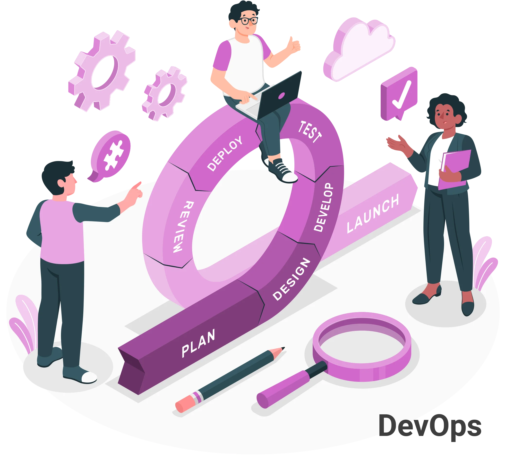

# DEVOPS

## Índice
1. [Introducción](#introducción)
2. [Las herramientas más populares para cada fase del ciclo de DevOps](#las-herramientas-más-populares)
3. [Empresas que han implementado DevOps](#empresas-que-han-implementado-devops)
4. [Empresas y casos reales de implementación de DevOps](#Empresas-y-casos-reales-de-implementación-dedevops)
5. [Infojobs, oferta empleo DevOps](#Infojobs,-oferta-empleo-DevOps)
6. [Infojobs, requisitos de la oferta](#Infojobs,-requisitos-de-la-oferta)
7. [Opinión sobre la oferta empleo](#Opinión-sobre-la-oferta-empleo)

## Introducción.

La filosofía DevOps es una metodología para creación de software basada en la integración entre desarrolladores de software y administradores de sistemas, permitiendo fabricar software más rápidamente, con mayor calidad, menor coste y una altísima frecuencia de releases, siendo el objetivo final minimizar el riesgo de los cambios que se producen en las entregas y dar así, un mayor valor tanto a los clientes como al propio negocio.

  

**La integración continua** (CI), permite que los equipos desarrollen de manera más ágil y con mayor confianza, minimizando riesgos y mejorando la calidad del código a lo largo del proceso de desarrollo, automatizando el mecanismo de revisión, validación, prueba y alertas.
El __despliegue continuo__ (CD) y la **entrega continua** (CE), garantiza que las aplicaciones estén listas para su despliegue en cualquier momento, permitiendo a las empresas ser más ágiles y capaces de lanzar nuevas características rápidamente, permitiendo así, implantar una nueva versión de la aplicación.
IaC reduce la complejidad y el esfuerzo de gestionar __infraestructura__, mejorando la agilidad y permitiendo a los equipos desplegar y escalar entornos de manera rápida y segura.
La **monitorización** y el __logging__, permiten identificar problemas y optimizar el rendimiento, jugando un papel clave en garantizar la seguridad y la resiliencia del sistema.
La **cultura colaborativa** promueve la comunicación abierta entre los equipos que deben colaborar en todo el ciclo de vida del software, desde la planificación hasta la implementación y el mantenimiento. 

## Las herramientas más populares para cada fase del ciclo de DevOps.

